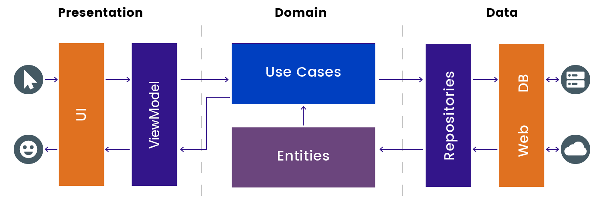
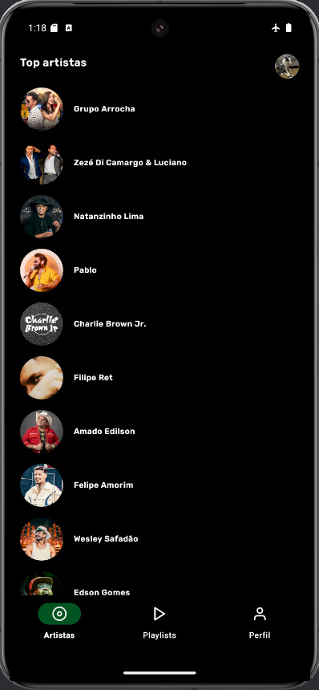
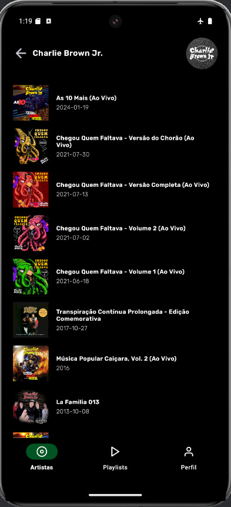
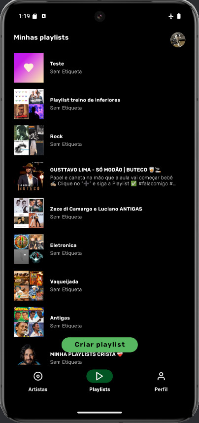
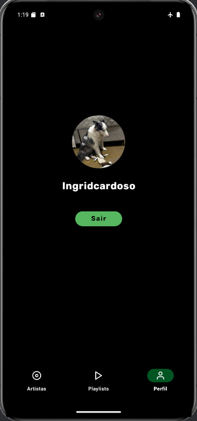

<h1 align="center">🎵 SpotifyApp - Clean Architecture + MVVM + Paging 3 + Room + Spotify Auth</h1>

<p align="center">
  <a href="https://wa.me/+5574999637391"></a>
  <a href="https://www.linkedin.com/in/pedro-henrique-de-souza-ar/"></a>
  <a href="mailto:pedro.steam2016@hotmail.com"></a>
</p>

<p align="center">  
📌 O SpotifyApp é um projeto Android desenvolvido em Kotlin que replica a experiência do Spotify utilizando autenticação oficial e acesso à API Web. A arquitetura segue os princípios da Clean Architecture, com foco em modularização, testabilidade, segurança e escalabilidade.

## Requisitos obrigatórios
- [X] Atenticação via Spotify
- [X] Listar artistas
- [X] Listar albuns de um artista
- [X] Utilizar paginação (scroll infinito ou não)
- [X] Funcionamento offline (manter dados em storage local)
- [X] Testes unitários
- [X] Seguimentação de commits

## Bônus
- [ ] Testes instrumentados
- [X] Integração com Firebase (Crashlytics)
- [X] CI/CD (pipelines e deploy)
- [X] Responsividade (celular e tablet)

## 🧱 Arquitetura
- Clean Architecture (Camadas de UI, Domain, Data)
- MVVM (Model-View-ViewModel)
- Injeção de dependência com Hilt
- Tratamento de estado com UiState e DataResource
- Paging 3 com RemoteMediator + Room
  
<p float="left" align="center">
 
</p>

## 🗂️ Estrutura Modular
  ### 🔹 Core Modules
  - analytics – Integração com Firebase Analytics e Crashlytics
  - common – Classes utilitárias, helpers, extensões
  - data – Room, Retrofit, Repositórios, RemoteMediators
  - domain – Use Cases e regras de negócio
  - eventbus – Comunicação desacoplada via EventBus
  - model – Models compartilhados
  - navigation – Navegação centralizada (routes)
  - testing – Utilitários e mocks para testes
  - designsystem – Componentes visuais reutilizáveis

### 🔸 Feature Modules
  - home – Tela inicial com lista de artistas
  - albums – Detalhamento e listagem de álbuns
  - playlist – Visualização e criação de playlists
  - profile – Perfil do usuário autenticado

### ⚙️ Infra
  - build-logic – Plugins Gradle personalizados (Convention Plugins)

## 🧩 Comunicação Desacoplada entre Features
As features do app são isoladas por módulos, utilizando uma estrutura com publicmodule e privatemodule para garantir baixo acoplamento e alta coesão:

### 📁 Exemplo: Feature Albums
- **albums:privatemodule:** Contém toda a lógica interna da feature (Fragment, ViewModel, Adapter, UiState, NavigationNode).
- **albums:publicmodule:** Expõe apenas contratos mínimos necessários (interfaces) para que outras features possam interagir com albums sem conhecê-la diretamente.

### 🔄 Comunicação por Contrato
A navegação para a feature Albums é feita via interface pública:
```kotlin
interface AlbumsFeatureCommunicator {
    fun launchFeature(albumsFeatureArgs: AlbumsFeatureArgs)

    data class AlbumsFeatureArgs(
        val previousRoute: String,
        val artist: Artist
    ) : Serializable
}
```

## 🔐 Autenticação Spotify e Gerenciamento de Sessão

A autenticação é realizada com a biblioteca oficial da Spotify:

```
implementation("com.spotify.android:auth:<versão>")
```

1. O app abre o login do Spotify com `AuthorizationClient.openLoginActivity(...)`.
2. Após a autenticação, é retornado um `authorizationCode`.
3. O código é trocado por um `access_token`, `refresh_token` e tempo de expiração via `AuthRepository`.

---

### 🧠 SessionManager

A classe `SessionManagerImpl` centraliza a lógica de autenticação e sessão segura do usuário, incluindo:

- Troca de `code` por token
- Armazenamento seguro do `access_token`, `refresh_token` e `expires_at`
- Armazenamento das credenciais do app (`clientId` e `clientSecret`)
- Atualização automática do token expirado

```kotlin
val isLoggedIn = sessionManager.isLoggedIn()

val token = sessionManager.getAccessToken()

val refreshed = sessionManager.refreshAccessToken()

sessionManager.clearSession()
```

Autenticação inicial:

```kotlin
sessionManager.loginWithCode(code, clientId, clientSecret)
```

Verificação e renovação automática da sessão:

```kotlin
val isSessionValid = sessionManager.ensureValidSession()
```

---

### 🔒 Armazenamento Seguro

Os tokens são armazenados com **EncryptedSharedPreferences**, utilizando o **Android Keystore** para garantir:

- Criptografia AES-256 na escrita e leitura
- Impossibilidade de acesso direto ao conteúdo salvo, mesmo com acesso root
- Proteção contra ataques físicos e lógicos ao armazenamento local

```kotlin
val prefs = EncryptedSharedPreferences.create(
    context,
    "secure_prefs",
    MasterKey.Builder(context)
        .setKeyScheme(MasterKey.KeyScheme.AES256_GCM)
        .build(),
    EncryptedSharedPreferences.PrefKeyEncryptionScheme.AES256_SIV,
    EncryptedSharedPreferences.PrefValueEncryptionScheme.AES256_GCM
)
```

Essa arquitetura garante que os dados sensíveis do usuário estejam protegidos mesmo em dispositivos comprometidos, seguindo as melhores práticas recomendadas pelo Android.

## 🔧 Configuração
- Acesse: [Spotify Developer Dashboard](https://developer.spotify.com/dashboard)
- Crie seu app e configure o redirect URI para: "pedroid://callback"
- Copie o CLIENT_ID e CLIENT_SECRET
- No arquivo keys.properties, insira:
  - CLIENT_ID=xxx
  - CLIENT_SECRET=xxx
 
## ▶️ Execução
- Pré-requisitos:
  - Java 17
  - Clone o projeto:
    - git clone https://github.com/Pedroid1/SpotifyApp.git
    - Abra no Android Studio e aguarde a sincronização do Gradle. Em seguida, execute o app em um emulador ou dispositivo real.

## Features Screenshots
<p float="left" align="left">
  
  
  
  
</p>
   
## 👨‍💻 Autor
Pedro Henrique de Souza Araujo | [Linkedin](https://www.linkedin.com/in/pedro-henrique-de-souza-ar/)
